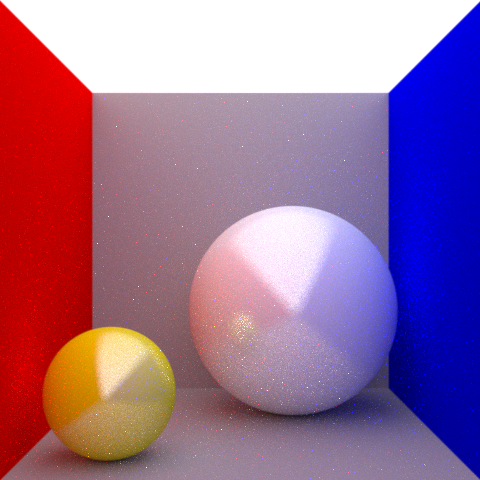

# Monte Carlo Path tracer

<p align="center">
  
</p>


## Features

* Only supports rendering spheres
* Custom textures
* Diffuse and emissive properties
* Reflections
* Gaussian Anti-Aliasing
* Multithreading for increased rendering speed
* Custom Resolutions

### Usage

```cpp
MonteCarloRenderer<sRGB, CustomResolution> renderer({480, 480});  // initialize renderer

renderer.SetSampling(1);  // increase checkerboard effect to reduce rendering time. (default = 1 = no checkerboard)
renderer.SetRenderQuality(8);  // number of samples/rays per pixel
renderer.SetCamera(eye, lookAt);  // set camera origin and orientation
renderer.SetFOV(36);  // set fielw of view
renderer.SetWriteToFile(false);  // if true, writes output to file
renderer.SetAASigma(0.5f);  // set the sigma of the normal distribution used for anti-aliasing
renderer.SetAA(true);  // enable/disable anti-alising


Scene default_scene{  
    TexturedSphere{{0, 0, 0}, 0, Colors::BLACK() /* null_sphere */ },
    TexturedSphere{{-1001, 0, 0}, 1000, Colors::RED()},
    TexturedSphere{{1001, 0, 0}, 1000, Colors::BLUE()},
    TexturedSphere{{0, 0, 1001}, 1000, Colors::GRAY()},
    TexturedSphere{{0, 1001, 0}, 1000, Colors::GRAY()},
    TexturedSphere{{0, -1001, 0}, 1000, Colors::WHITE(), Colors::WHITE()},
    TexturedSphere{{-0.6, 0.7, -0.6}, 0.3, Colors::YELLOW(), Colors::BLACK(), Colors::WHITE()},
    TexturedSphere{{0.3, 0.4, 0.3}, 0.6, Colors::CYAN(), Colors::BLACK(), Colors::WHITE()},
};  // define a scene								

renderer.SetScene(default_scene);  // submit the scene
renderer.Run();  // start rendering
```